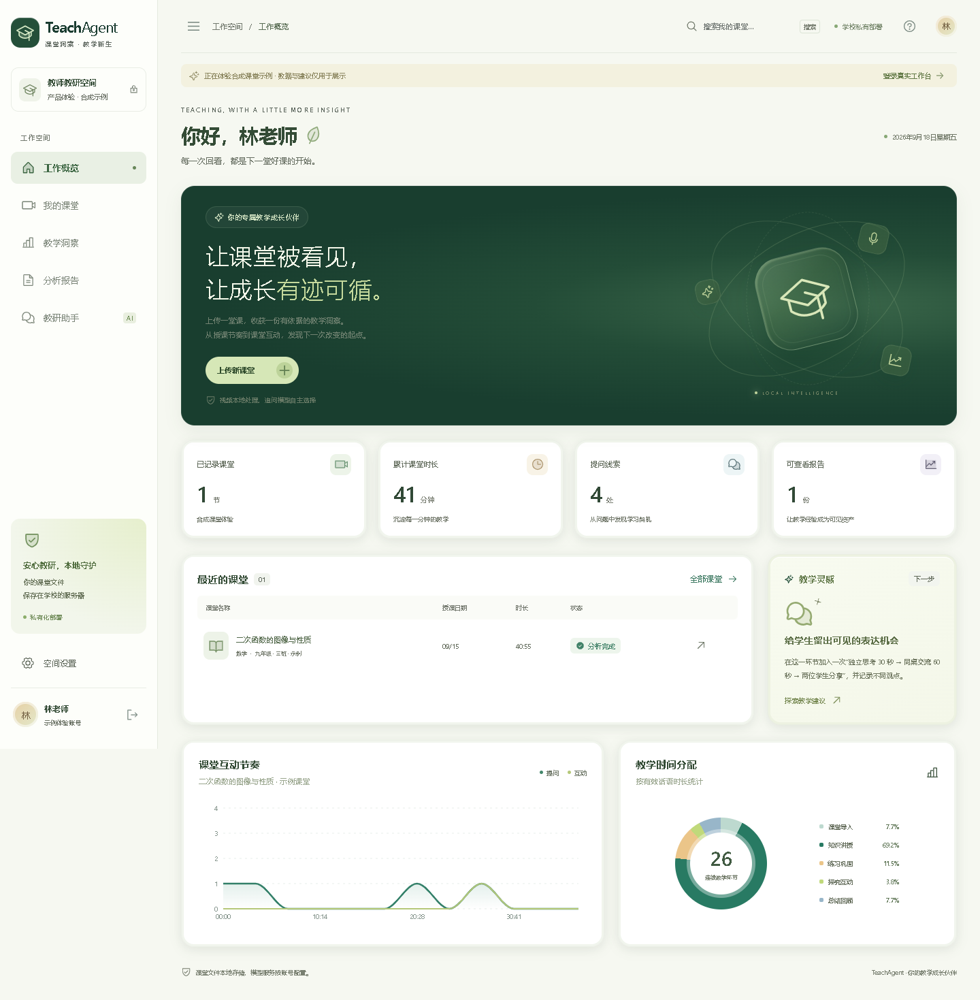

# TeachAgent

### 让课堂被看见，让成长有迹可循。

面向学校内网的课堂分析与教研 Agent 工作台。默认全部在学校本地处理与保存；可按教师账号启用 OpenAI 兼容在线模型进行教研追问。启用并确认后，仅课堂文本上下文发送至所配置的服务；视频、音频、抽帧和基础分析仍在本地。界面无埋点、外部字体或 CDN。



## 在线演示与自动部署

[体验 GitHub Pages 工作台](https://mm477706421.github.io/TeachAgent/)

Pages 只提供合成课堂演示，直接进入工作台，不显示教师登录表单、不读取真实视频、不调用后端 API。报告示例和演示对话在浏览器内生成。学校正式使用请按下方步骤部署本地服务。

推送到 `main` 后，GitHub Actions 依次执行后端与本地版浏览器测试、Pages 构建、静态演示浏览器测试，全部通过后部署。也可在 Actions 手动运行工作流。CI 使用内置 `GITHUB_TOKEN` 和 OIDC，不需要保存个人访问令牌为仓库 Secret。

Pages 构建命令为 `npm run build:pages`，仓库路径为 `/TeachAgent/`，输出目录 `frontend/dist-pages/`；本地版仍使用 `npm run build` 和 `frontend/dist/`。仅静态演示产物会上传到 Pages，数据目录、模型、密码和本机配置不会上传。

## 已实现

- **本地视频管线**：MP4 / MOV / MKV / AVI / WebM / M4V 上传，FFmpeg 抽帧与音轨提取，faster-whisper 离线转写，任务进度、失败原因与重试。
- **文本蒸馏与画像**：TXT / SRT / VTT 导入，文本清洗，环节时间轴、提问和互动线索、话语语速、语言习惯及证据化改进建议。
- **可配置教研助手**：本机 Ollama / 本地规则 / OpenAI 兼容服务；独立账号配置、连接测试、密钥本地加密、基于课堂证据连续追问。在线失败明确报错，本机 Ollama 不可用时明确退回规则建议。
- **教师独立空间**：账号登录、会话校验、课堂数据隔离、视频回看、原文定位、Markdown / JSON / HTML 报告导出。
- **学校管理**：教师账号创建、按账号 ZIP 数据备份、审计日志、密码修改与本地密码重置。
- **响应式 WebUI**：宽屏可折叠侧栏、平板图标栏、手机抽屉导航；侧栏独立滚动，搜索、图表、表格、表单和课堂详情覆盖 320px 至 1920px。墨绿暖白风格与合成示例保留。

> 一期分析以语音和文本为主。环节与互动由可审计规则识别，不输出伪造的教学评分或师生占比。动作、板书、声纹分离与深度视觉分析属于扩展能力。

## 快速运行

环境：Python 3.12、Node.js 22+、FFmpeg（含 ffprobe）。首次安装依赖需要联网；本地模式正式运行可完全断网，在线模型追问需要访问配置的服务。

```powershell
python -m venv .venv
.venv/Scripts/python -m pip install -r requirements.txt
cd frontend
npm ci
npm run build
cd ..
.venv/Scripts/python -m backend.cli create-admin
.venv/Scripts/python -m uvicorn backend.main:app --host 127.0.0.1 --port 8000 --workers 1
```

管理员命令会生成随机密码，请保存该本地终端输出。访问 **http://127.0.0.1:8000**，登录后即可导入文本分析；也可以在登录页体验只读合成示例。

Linux 将 `.venv/Scripts/python` 换为 `.venv/bin/python`。生产运行必须使用 **1 个 Uvicorn worker、1 个应用实例**；ASR 队列按顺序执行。

### 准备本地模型

1. 在独立联网准备环境下载完整的 `Systran/faster-whisper-small` 模型目录。
2. 搬运到 `models/whisper-small/`，至少包含 `model.bin`、`config.json`、`tokenizer.json`、词表等模型原始文件。
3. 将 `.env.example` 复制为 `.env`，设置模型和 FFmpeg 路径。
4. 在“空间设置”检查就绪状态，然后上传有音轨的课堂视频。

运行时强制 `HF_HUB_OFFLINE=1`、`TRANSFORMERS_OFFLINE=1` 和 `local_files_only=True`，不会自动下载模型。模型不随源码或 Release 分发。

### 可选：本机 Ollama

在联网准备阶段预装 Ollama 并执行 `ollama pull qwen2.5:7b`，随后断网运行。默认地址为 `http://127.0.0.1:11434`。只接受本机回环 IP，禁止外部 URL、代理继承与重定向。没有 Ollama 也能转写、分析和导出，追问会显示“本地规则建议”。

### 可选：OpenAI 兼容在线模型

登录后进入 **空间设置 → 模型服务设置**，选择“OpenAI 兼容服务”，填写 Base URL（例如 `https://api.openai.com/v1`）、服务支持的模型 ID、API Key，确认文本发送范围，点击“测试连接”，成功后点击“保存模型设置”。测试使用当前表单，不自动保存、不发送课堂材料。支持非流式 `/chat/completions`，参数包括超时、温度与输出 token 上限；服务需支持这些参数。

设置只作用于当前账号的教研追问，不替代本地 ASR 或基础分析。追问发送本课摘要、指标、建议、方法边界、前 100 个转写片段、最近 8 条对话及当前问题。页面展示目标服务和回答来源；认证失败、限流、超时会明确报错。

API Key 用 Fernet 加密存入本地 SQLite，解密密钥位于 `TEACHAGENT_DATA/model-settings.key`。页面不会回显密钥，也不写入浏览器本地存储。同地址留空保留密钥，支持主动清除；更改服务地址后不沿用旧密钥。按账号 ZIP 不包含模型设置或密钥；整机灾备必须包含密钥文件。公开 Pages 仅预览设置，不接收 API Key、不调用模型。

### Docker

```bash
docker compose up -d --build
docker compose exec teachagent python -m backend.cli create-admin
```

默认只向宿主回环地址发布 8000 端口。学校访问应使用内网 HTTPS 反向代理，并设置 `COOKIE_SECURE=1`。容器中的 `127.0.0.1` 指向容器本身；与宿主 Ollama 协作的 Linux host-network 配置见部署文档。

## 文档

- [详细功能与部署文档](docs/功能与部署文档.md)：全部功能、操作步骤、计算口径、架构、部署、备份恢复、API、验收与扩展。
- [Word 版功能文档](docs/TeachAgent-功能与部署文档.docx)
- [1.1 系统检验报告](docs/系统检验报告-2026-09-18.md)：本轮功能矩阵、真实离线转写与未测边界。
- [1.0 验收记录](docs/验收记录.md)：历史测试结果。
- [响应式布局验收](docs/响应式布局验收.md)：断点行为、导航交互与浏览器矩阵。
- [版本变更](CHANGELOG.md)

## 开发与验证

```bash
python -m pip install -r requirements-dev.txt
python -m pytest -q
cd frontend
npm run build
# 在后端已启动的条件下运行：
npm run test:e2e
```

浏览器默认使用系统 Microsoft Edge；其他环境设置 `PLAYWRIGHT_CHANNEL=chromium` 并运行 `npx playwright install chromium`。真实登录端到端检查需设置 `TEACHAGENT_E2E_USERNAME` 与 `TEACHAGENT_E2E_PASSWORD`。

本地双服务开发：后端 8000 端口，前端 `npm run dev` 启动 Vite；`/api` 自动代理到本机后端。生产部署使用 FastAPI 托管构建后的前端。

## 数据与开源范围

源码采用 MIT 许可。学校数据归学校统一管理。`.data/`、`.env`、模型、虚拟环境和个人账号信息不进入 Git。仓库内课堂内容全部为明确标注的人工合成示例。
