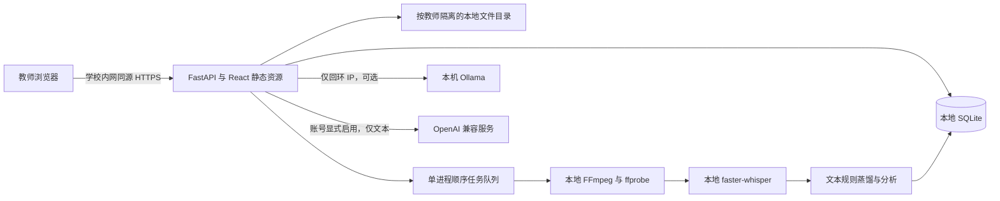

# TeachAgent 功能与部署文档

版本：1.1.0

文档日期：2026-09-18

适用对象：学校项目负责人、教师、教研管理员、信息中心与部署运维人员。

## 1. 系统定位与交付范围

TeachAgent 是学校私有部署的课堂分析 WebUI Agent 系统。教师上传课堂视频，系统在本地抽帧、转写、清洗和结构化话语，生成授课方式画像与可优化点清单。教师可围绕课堂证据连续追问，并下载报告。管理员负责账号与按账号数据备份。

一期以“语音转写 + 文本级教学分析”为主。视频抽帧用于回看参考，不对抽帧进行动作、情绪、板书或姿态识别。系统不是自动教师评分工具，不能仅凭文本判定真实师生互动质量。

### 1.1 需求对应表

| 原始需求 | 一期实现 | 使用入口 |
| --- | --- | --- |
| 常见课堂视频上传 | MP4、MOV、MKV、AVI、WebM、M4V；分块落盘 | 上传新课堂 |
| 自动抽帧与本地 ASR | FFmpeg 抽帧、16kHz 单声道音轨、faster-whisper | 视频任务自动执行 |
| 清洗与按环节分段 | 清理标签、不可见字符、空白；关键词环节识别与相邻合并 | 转写与环节 |
| 课堂数据蒸馏 | 话语、时间、显式角色、环节、提问、互动、语言习惯 | 结构化 JSON |
| 授课方式画像 | 节奏曲线、时间分配、提问线索、互动邀请、语速 | 教学洞察 |
| 可优化点清单 | 按本课文本给出证据、定位片段、具体尝试动作 | 可优化点 |
| AI 追问 | 本机 Ollama / 本地规则 / 按账号 OpenAI 兼容服务；来源明确标注 | 教研助手 / AI 追问 |
| 教师账号与数据隔离 | 账号登录、会话、接口层所有权检查、独立文件目录 | 教师入口 |
| 查看与下载报告 | Markdown、JSON、HTML；HTML 可由浏览器打印 PDF | 分析报告 |
| 私有化与内网运行 | 同源静态资源、SQLite、本地文件、本地模型 | 本地或 Docker 部署 |
| 管理员按账号导出备份 | ZIP 包含元信息、课堂文件、分析、对话，无密码或会话 | 学校管理 |

### 1.2 交付物

完整 React / TypeScript 前端、FastAPI 后端、数据库初始化与账号命令、合成示例、Dockerfile、Compose、Nginx 示例、自动化测试、GitHub Actions CI、功能文档与版本 Release。Release 应包含构建后的 WebUI 和源码；模型及真实学校数据不分发。

## 2. 角色与权限

| 操作 | 未登录访问者 | 教师 | 管理员 |
| --- | --- | --- | --- |
| 浏览合成示例 | 只读 | 可添加到自己的空间 | 可添加到自己的空间 |
| 上传视频 / 导入文本 | 不允许 | 自己的空间 | 自己的空间 |
| 查看、回放、追问、下载报告 | 不允许 | 仅自己的课堂 | 仅自己的课堂 |
| 删除课堂 | 不允许 | 仅自己且未在处理中的课堂 | 仅自己且未在处理中的课堂 |
| 修改密码 | 不允许 | 自己 | 自己 |
| 创建教师账号 | 不允许 | 不允许 | 允许 |
| 按账号导出备份 | 不允许 | 不允许 | 学校内任一账号 |
| 查看审计日志 | 不允许 | 不允许 | 最近 200 条 |

管理员没有通过普通课堂详情接口静默浏览所有教师数据的特殊通道；学校统一管理使用明确的账号备份入口，并记录审计事件。账号备份内容属于学校敏感资料，下载后由学校按内部制度存储。

## 3. 教师操作流程

### 3.1 登录与空间

1. 信息中心在服务器创建首个管理员。系统没有预置通用管理员密码。
2. 管理员在“学校管理 → 新建教师账号”输入姓名、账号、初始密码。
3. 教师使用学校分配的账号登录。会话最长有效 12 小时。
4. 进入“空间设置”修改初始密码。修改后所有旧会话立即失效，需要重新登录。
5. 每个教师空间初始为空，不把示例数据当成学校真实记录。

登录页的“体验示例工作台”是前端只读演示，不创建真实账号，也不写入数据库。示例的统计、文字与建议均标注为合成内容。

### 3.2 视频上传与处理

点击“上传新课堂”，填写课堂名称、学科、班级。点击选择或拖入视频，确认后上传。默认单文件最大 2048 MB、媒体时长最长 6 小时。长课建议先按课时切分。

前端展示真实传输进度；传输完成后进入本地处理队列，状态每 3 秒刷新。处理顺序如下：

1. **媒体检查**：ffprobe 解析容器与流信息，确认存在音轨，读取时长；未安装 ffprobe 时使用随 ASR 依赖安装的本地 PyAV 检查。
2. **参考抽帧**：FFmpeg 按 `max(30 秒, 视频时长 / 60)` 的间隔抽帧，最多 60 张，宽度 640 像素并保持比例。
3. **音轨提取**：转为 16kHz、单声道 WAV。
4. **离线 ASR**：加载本地 faster-whisper，中文识别，beam size 5，VAD 开启。
5. **文本清洗与蒸馏**：保留每段 ASR 时间戳，生成可追踪结构。
6. **画像与建议**：计算统计、环节和证据化优化清单，保存 JSON。

短视频若常规 30 秒采样未产生帧，会补抽首帧。抽帧、WAV 和原视频均保存在所属教师的本地目录内。即使抽帧已完成，ASR 模型缺失时也会将任务标记为失败，并显示安装模型提示。

任务状态：`uploading → queued → processing → completed`，错误进入 `failed`。服务重启时将未完成任务标记为中断，教师可手动重试。重试重新执行管线，不会自动重复创建课堂记录。

### 3.3 文本导入

没有配置语音模型时，可以导入已经在本地产生的转写文本。支持粘贴文本或读取 UTF-8 TXT、SRT、VTT 文件。

- SRT 保留 `HH:MM:SS,mmm` 时间戳。
- VTT 支持 `HH:MM:SS.mmm` 和 `MM:SS.mmm`。
- 普通文本按换行及句末标点分段。时长按每秒 3.5 字估算、每段最少 3 秒，界面和报告明确说明估算性质。
- 文本最多 200,000 字符；前端本地文件读取限制 1 MB；话语片段最多 10,000 段。
- 可在原文显式标注“教师：”“老师：”“师：”和“学生：”“生：”。其他内容保持“未标注说话人”。

纯文本导入不自动关联视频。点击时间不会伪装播放；界面会告知未关联视频或时间为估算。

### 3.4 阅读教学画像

“我的课堂”可按关键词搜索课堂名称、学科和班级，并按状态筛选。打开课堂后有四个页签：

| 页签 | 内容 |
| --- | --- |
| 授课方式画像 | 教学观察摘要、提问/互动/语速/话语指标、节奏曲线、教学时间分配、环节时间轴、方法边界 |
| 转写与环节 | 搜索原文、片段编号、时间、文本角色、环节、提问标签；有视频时同步定位 |
| 可优化点 | 优先级、问题描述、课堂证据、片段跳转、下一堂课的实践动作 |
| AI 追问 | 基于当前课堂的连续对话，展示本机模型或规则引擎来源 |

环节时间轴和建议中的“查看片段”可跳到原文。视频能否在浏览器中直接播放取决于浏览器支持的编码；不支持播放的 AVI/MKV 等仍可由 FFmpeg 转写，不保证所有编码都能在 Web 播放器回放。

### 3.5 报告下载

- **Markdown**：便于教研记录、二次编辑和归档。
- **JSON**：包含课堂元信息与全部蒸馏数据，便于学校后续研究。
- **HTML**：自包含文本报告，无外部字体或脚本；下载后打开，通过浏览器“打印 → 另存为 PDF”。不是服务端直接生成 PDF。

报告包含教学画像、指标、时间分配、优化清单、方法边界和完整转写。示例报告明确标注合成性质。下载事件记入本地审计。

## 4. 分析方法与计算口径

### 4.1 蒸馏数据结构

每个话语片段包含：`id`、`start`、`end`、`text`、`timing`、`speaker`、`stage`、`question`、`interaction`。其中 `timing` 为 `asr`、`provided` 或 `estimated`。

分析结果包括 `summary`、`metrics`、`segments`、`timeline`、`distribution`、`questions`、`interactions`、`fillers`、`rhythm`、`suggestions` 和 `limitations`。默认 `engine=local-text-rules`，版本字段为 `1.0`。

### 4.2 文本清洗

去除 HTML 风格标签、零宽或 BOM 等不可见字符，合并连续空白，剔除空段。不会为“美化”转写而删去口头词，否则语言习惯统计失真。ASR 原文不由云端纠错或补写。

### 4.3 教学环节

规则优先级依次为：课堂导入、探究互动、练习巩固、总结回顾；没有命中关键词时归入知识讲授。关键词示例：

| 环节 | 关键词示例 |
| --- | --- |
| 课堂导入 | 上节课、今天我们、同学们好、回顾、导入 |
| 探究互动 | 讨论、小组、谁来、你认为、为什么、想一想、试一试 |
| 练习巩固 | 练习、完成、做一做、作业、计算、独立 |
| 总结回顾 | 总结、这节课、下课、收获、归纳 |

相邻同类环节在片段间隔小于 15 秒时合并。规则可能把介绍“讨论”一词的讲授识别为互动，也可能漏掉没有关键词的互动。因此这些是待教师核实的结构化线索，不是人工精确标注。

### 4.4 核心指标

| 指标 | 计算方式 | 注意事项 |
| --- | --- | --- |
| 课堂时长 | 视频时长与末段结束时间中的较大值 | TXT 为估算时长 |
| 有效字符 | 清洗后移除非词字符的数量 | 不等于分词意义的词数 |
| 话语片段 | 非空转写片段数量 | ASR 切分粒度会影响数量 |
| 提问线索 | 含问号或“为什么/如何/什么/是否”等疑问线索的片段数 | 一个片段中多问仍按一处计算，不区分教师与学生 |
| 互动邀请 | 含“讨论/小组/谁来/请回答/举手/分享/你认为/同桌”等词的片段数 | 不代表实际参与人数或有效互动次数 |
| 话语语速 | 有效字符 ÷ 全部话语片段有效时长（分钟） | 不含视频静默区间，非纯教师语速；重叠字幕会影响结果 |
| 时间分配 | 某环节片段时长之和 ÷ 全部有效话语时长 | 不等于整个视频包含静默的时间占比 |
| 互动节奏 | 将课堂时间等分为 12 个区间，按片段开始时间归入区间 | 曲线展示线索计数，不是质量评分 |
| 语言习惯 | “那么/然后/就是说/对不对/是不是/嗯/那个”等表达出现次数 | 合理教学用法仍会被计入，应人工复核 |

工作概览汇总真实课堂；已登录空间中的合成示例不计入真实教学总量。只读体验工作台则显示示例本身的统计，并有显著示例标识。

### 4.5 可优化点

当前建议依据互动邀请数量、提问示例、口头表达频次以及总结线索是否存在来生成。每条建议含优先级、标题、证据、实施动作和片段编号。例如互动线索较少时建议加入“独立思考 30 秒 → 同桌交流 60 秒 → 两人分享”，并关联课堂中的连续环节。

建议属于教研启发，不宣称某一种教学方式适用于所有学科或课型。用户应结合教学目标、年级、学情和原始视频判断。

## 5. Agent 与可配置模型追问

系统采用明确的本地任务管线：媒体检查 → 抽帧 → ASR → 文本蒸馏 → 分析报告 → 基于证据的追问。不会执行课堂文本中的命令，也不开放任意工具调用或外部网页检索。

配置了 Ollama 时，请求仅发送到 `OLLAMA_URL` 指定的本机回环 IP。发送给模型的上下文包括当前课堂摘要、指标、优化建议、前 100 个转写片段和最近 8 条对话消息。长课堂后半段若不在上下文内，模型无法逐段完整理解；应通过片段引用与报告核实，不能假定已读取全部原文。

模型提示要求区分观察与建议、引用证据、不得虚构师生占比，并将转写作为不可信待分析数据。所有回答最终仍需教师复核。

请求默认超时为 60 秒，输出上限参数为 900 tokens，温度 0.3。不在线拉取模型。连接失败、模型不存在或返回异常时使用本地规则建议，界面清楚显示来源。规则模式依据问题中的互动、提问、语言等关键词选择相关建议，不承诺大模型自由对话能力。

### 5.1 在线模型设置操作

1. 在学校本地部署登录教师账号，进入“空间设置 → 模型服务设置”。
2. 选择“OpenAI 兼容服务”。填写服务的 API 前缀，例如 `https://api.openai.com/v1`，不要填写网页聊天入口；系统会调用 `/chat/completions`。也接受以 `/chat/completions` 结尾的地址并自动规范化。
3. 填写服务商实际支持的模型 ID 和 API Key。免鉴权的兼容服务可以不填密钥。禁止 URL 内嵌账号、查询参数、片段和无效端口。
4. 阅读数据发送范围并勾选同意。点击“测试连接”发送一条固定测试语句，不包含课堂数据；可能产生少量模型费用。测试成功不等于已保存设置。
5. 点击“保存模型设置”。下一次追问读取当前账号配置。配置后进入课堂的“AI 追问”查看目标服务和回答来源。
6. 需要关闭在线请求时，选择“本地规则建议”或“本机 Ollama”并保存。切换模式不会自动删除已保存密钥，需要删除时在兼容服务面板勾选清除并保存。

| 设置项 | 默认值 / 范围 | 行为 |
| --- | --- | --- |
| 提供方式 | 本机 Ollama | local / rules / openai，账号互不影响 |
| Base URL | https://api.openai.com/v1 | 仅服务前缀；支持 HTTP / HTTPS、域名或 IP |
| 模型 ID | 未配置 | openai 模式必填，由服务商确定 |
| API Key | 未配置 | 只写不读回；同地址留空保留，换地址清除旧密钥 |
| 允许文本外发 | 否 | openai 模式测试及保存前必须明确同意 |
| 请求超时 | 60 秒；5–120 | 包含总请求时间限制 |
| 温度 | 0.3；0–2 | 服务需支持 temperature 参数 |
| 输出上限 | 900；128–4096 | 使用 max_tokens 参数 |

兼容范围为 HTTP Chat Completions、Bearer 鉴权（可选）、非流式纯文本 `choices[0].message.content`。本版本不支持 Responses API、流式 SSE、工具调用、图像输入或某些推理模型的专用参数。个别服务不接受 temperature/max_tokens 时，连接测试会报错，应选择支持该协议的模型或网关。

### 5.2 数据流向、错误与凭据管理

默认本地处理保持不变。在线仅作用于教研追问：发送当前课堂摘要、指标、优化建议、方法边界、前 100 个转写片段、最近 8 条历史消息与当前问题。视频、音频、抽帧、其他教师数据及基础报告计算不外发。长课超过 100 段的原文不会全部提供给模型；历史中已有的课堂引用也可能随历史消息发出。学校应按自己的数据制度决定是否启用。

在线失败明确返回错误：401/403 显示认证失败，404 显示地址或模型不存在，429 显示限流或额度不足；超时返回 504，其余服务故障返回 502。重定向不会自动跟随，响应超过 1 MB、空文本或不兼容 JSON 均拒绝。失败不会保存成成功问答，也不静默切换规则。Ollama 不可用时保留原有规则降级行为；手动规则模式不发模型请求。

凭据由 Fernet 加密后存入本地 SQLite；主密钥保存于数据目录 `model-settings.key`。接口仅返回 `api_key_configured`，不返回原文或密文。密钥不存入浏览器 localStorage，不进入审计日志、课堂报告或按账号 ZIP。更改服务地址时不沿用旧密钥，避免把原服务凭据发给新目标。模型设置验证错误不回显原始请求内容。

文件加密不能抵御拥有服务器和解密密钥访问权限的管理员。部署时限制数据目录的操作系统权限；完整灾备必须保护并包含主密钥。缺失主密钥时服务拒绝使用旧凭据，允许清除后重新配置。公开 Pages 只能预览配置，完全不收集 API Key，也不会连接服务。

## 6. 架构与本地数据边界



### 6.1 技术栈

前端：React 19、TypeScript、Vite、Recharts、Phosphor 图标、自定义 CSS。后端：Python 3.12、FastAPI、SQLite WAL、faster-whisper、FFmpeg。前端构建后的资源由同一个 FastAPI 服务托管。

### 6.2 存储布局

```text
.data/
  teachagent.sqlite3           # 账号、会话、课堂索引、分析、消息、审计
  users/
    <teacher_uuid>/
      <lesson_uuid>/
        source.video          # 原视频，仅视频任务
        audio.wav             # 本地提取音轨
        frames/001.jpg ...    # 最多 60 张参考抽帧
        transcript.txt        # 文本导入的原文
        analysis.json         # 完整分析结构
models/
  whisper-small/              # 管理员预置的完整本地模型
```

ASR 转写包含在 `analysis.json` 的 `segments` 中。数据库与文件中的分析均落在本地。文件路径使用服务端 UUID，不采用用户上传的路径；帧接口严格限制三位数字文件名。

### 6.3 隔离与安全实现

- 所有课堂详情、报告、媒体、抽帧、对话、重试、删除接口按登录用户 ID 与课堂 ID 联合查询。
- 无权限访问其他人的课堂返回 404；教师调用管理员接口返回 403。
- PBKDF2-HMAC-SHA256 加盐密码哈希，600,000 次迭代。
- 随机会话令牌只保存在 HttpOnly、SameSite=Strict Cookie；数据库仅保存其 SHA-256 摘要。
- 写请求校验会话 CSRF token；显式跨 Origin 的写请求被拒绝。
- 登录失败次数按账号与客户端计数，15 分钟内达到 10 次后限制；成功登录清除相应计数。
- API 设置 no-store，页面设置 CSP、禁止框架嵌入和 MIME 嗅探。
- 报告 HTML 对用户文本转义。Markdown / JSON 是下载资料，不直接执行其中内容。
- Ollama 只允许回环 IP HTTP。兼容服务允许 HTTP / HTTPS，可使用域名、内网 IP 或回环地址；二者均关闭环境代理和重定向。API Key 加密保存、接口不回显，模型错误不透传服务商响应正文。
- 前端不使用外部字体、CDN、遥测、分析埋点或在线图片。

应用不提供磁盘加密与跨进程强租户沙箱。学校应使用操作系统访问控制、加密磁盘和网络防火墙保护服务器。持有数据库或服务器管理员权限的人能管理本地教学数据。

## 7. 安装与部署

### 7.1 建议环境

| 场景 | 建议起点 |
| --- | --- |
| 文本分析与演示 | 4 核 CPU、8 GB 内存、本地 SSD |
| CPU 中文转写 | 8 核 CPU、16 GB 内存，small 模型 int8；速度以实际课堂测试为准 |
| GPU 转写 | NVIDIA GPU 与对应 CUDA/cuDNN/ctranslate2 环境，显存按模型规模选择 |
| 存储 | 根据原视频保留期估算；额外保留音轨、抽帧、备份及处理临时空间 |

以上是部署起点，不是实测吞吐承诺。课堂噪声、录音质量、视频长度和设备型号影响识别质量与耗时。普通服务器默认一条 ASR 任务串行执行，避免同时加载多个模型。

### 7.2 Windows 原生部署

```powershell
python -m venv .venv
.venv/Scripts/python -m pip install -r requirements.txt
Copy-Item .env.example .env
cd frontend
npm ci
npm run build
cd ..
.venv/Scripts/python -m backend.cli create-admin --username admin --name 教研管理员
./scripts/start.ps1
```

在 `.env` 填写 FFmpeg、ffprobe 和模型的绝对路径，含空格时使用引号。首个管理员密码自动随机生成，请记录并妥善交接。默认访问 `http://127.0.0.1:8000`。

可以在调用账号命令前设置 `TEACHAGENT_ADMIN_PASSWORD` 指定密码，但不要将真实密码写入代码、命令示例或版本库；用完后清除此环境变量。

### 7.3 Linux 原生部署

```bash
python3.12 -m venv .venv
.venv/bin/python -m pip install -r requirements.txt
cp .env.example .env
cd frontend
npm ci
npm run build
cd ..
.venv/bin/python -m backend.cli create-admin
sh scripts/start.sh
```

由系统包管理器预装 FFmpeg。生产可交给 systemd 管理，工作目录必须是项目根目录，运行身份应为独立普通用户，数据目录只授予该用户和学校管理员访问。

### 7.4 Docker 部署

```bash
docker compose up -d --build
docker compose exec teachagent python -m backend.cli create-admin
```

镜像构建需要联网下载基础镜像、系统包和开发依赖；可以在联网准备机构建后 `docker save`，搬入内网后 `docker load`。Compose 数据使用持久卷，模型目录以只读挂载。镜像进程以 UID 10001 普通用户运行，移除 Linux capabilities，并禁止提权。

默认 Docker 网络下不能通过容器的 127.0.0.1 访问宿主 Ollama。Linux 如需共享宿主本机 Ollama，可将服务改用 `network_mode: host`，移除 `ports`，并将启动命令改成只监听 `127.0.0.1:8000`，从同机 Nginx 转发。`OLLAMA_URL` 仍只接受本机回环 IP；需要在线服务时使用“模型服务设置”的 OpenAI 兼容方式。Windows 建议原生部署应用与 Ollama，或使用规则建议模式。

### 7.5 内网访问与断网运行

学校内部 DNS 配置例如 `teachagent.school.lan`，使用学校证书与 Nginx 示例 `deploy/nginx.conf`。代理必须保留原 Host，配置上传大小和长连接超时。HTTPS 环境将 `COOKIE_SECURE=1`。

依赖安装、模型预下载、GitHub 源码发布属于开发或部署准备阶段，不发送课堂材料。如采用纯本地模式，正式运行时关闭学校服务器外网出口，模型与资料不需要外网。若学校选择兼容在线模型，应只允许后端访问批准的服务地址，追问会发送明确列出的文本上下文；浏览器仍只连接本地应用源。不要在运行时开放模型自动下载。更新软件时采用离线包审查与搬运流程。

### 7.6 环境变量

| 名称 | 默认 | 说明 |
| --- | --- | --- |
| TEACHAGENT_DATA | 项目根目录/.data | 数据库与课堂文件根目录 |
| ASR_MODEL_PATH | models/whisper-small | 完整本地模型目录 |
| ASR_DEVICE | cpu | cpu 或在完整 CUDA 环境中的 cuda |
| ASR_COMPUTE | int8 | CPU 推荐 int8，GPU 可按环境选 float16 |
| FFMPEG_PATH | ffmpeg | 可执行文件名或绝对路径 |
| FFPROBE_PATH | ffprobe | 可执行文件名或绝对路径 |
| MAX_UPLOAD_MB | 2048 | 视频上传限额，反向代理需同步设置 |
| OLLAMA_URL | http://127.0.0.1:11434 | 只允许回环 IP HTTP |
| OLLAMA_MODEL | qwen2.5:7b | 本机预先安装的模型名 |
| COOKIE_SECURE | 0 | HTTPS 环境设 1 |

`.env` 在启动时加载，环境变量优先；修改后需要重启。必须使用单进程、单实例。增加 `--workers` 会使各进程队列与重启恢复逻辑冲突。

## 8. 管理、备份与恢复

### 8.1 教师账号管理

管理员可在 WebUI 创建教师账号。账号为 3–64 位字母、数字、下划线、点或短横线；密码至少 10 位。UI 默认创建 teacher 角色，管理员 API 可按校内管理流程创建 admin 角色。

忘记密码由具有服务器权限的信息中心执行：

```bash
python -m backend.cli reset-password --username teacher01
```

该命令生成新随机密码，并撤销该账号所有会话。没有公开自助注册、短信密码找回或外部身份服务。

### 8.2 按账号备份

“学校管理 → 教师账号 → 导出备份”下载 ZIP，包含：

- `manifest.json`：导出版本、时间、账号公开元信息、该账号课堂记录与对话。
- `files/<lesson_uuid>/...`：该账号全部原视频、音轨、抽帧、原始导入文本、分析 JSON。
- 不包含密码哈希、会话令牌、其他账号的数据。

存在排队、上传或处理中的任务时，返回 409 并提示完成后备份。备份使用磁盘临时文件，避免把大视频全部放入内存。备份过程请暂停该账号上传与删除操作；一期不提供跨文件与数据库的在线原子快照。

按账号 ZIP 故意不包含模型服务设置、加密后的 API Key 或解密密钥，避免归档教研资料时扩大凭据暴露范围。

### 8.3 整机备份与恢复

按账号 ZIP 用于数据导出和教研资产归档，当前不提供 WebUI 一键回灌。整机灾备使用停止服务后的完整数据目录备份：

1. 通知教师暂停操作，等待任务结束，停止应用。
2. 备份完整 `TEACHAGENT_DATA`，包括 SQLite、可能存在的 `-wal` / `-shm`、`users/` 与 `model-settings.key`。缺失或更换解密密钥将无法解密已保存的 API Key；需恢复原文件，或在界面清除旧密钥后重新填写。
3. 另行保存 `.env`、版本号、模型名称与版本、部署配置；密码等配置放入学校受控备份区域。
4. 恢复时部署相同版本，停止服务，将完整数据目录恢复到指定位置并校验属主权限。
5. 确认模型目录、FFmpeg 路径与磁盘空间，重启后抽查两个教师的隔离性、视频、报告与对话。
6. 可在 SQLite 中执行 `DELETE FROM sessions;` 撤销恢复数据中的旧会话，然后要求重新登录。

Docker 数据卷应使用一致的停止服务后卷备份流程。不要仅复制运行中的 SQLite 主文件并认为备份完整。恢复前保留当前数据快照，避免覆盖唯一副本。

### 8.4 删除与保留

教师删除课堂需要二次确认，删除数据库记录、消息及课堂文件。处理中的任务拒绝删除。删除不是回收站，无法在界面撤销。没有自动保留期清理，学校可以先备份再按数据制度清理。

## 9. API 概览

完整 OpenAPI 位于本地 `/docs` 与 `/openapi.json`。业务 API 前缀 `/api`。

| 方法 | 路径 | 用途 |
| --- | --- | --- |
| GET | /health | 存活、版本与本地处理标识 |
| POST | /auth/login | 登录并返回用户与 CSRF token |
| GET | /auth/me | 当前用户与 CSRF token |
| POST | /auth/logout | 注销当前会话 |
| POST | /auth/password | 修改密码并撤销所有会话 |
| GET | /system | 模型文件、FFmpeg、磁盘与配置状态 |
| GET | /lessons | 仅自己的课堂列表 |
| POST | /lessons/upload | multipart 视频上传 |
| POST | /lessons/text | JSON 文本导入与立即分析 |
| POST | /lessons/example | 为当前账号添加明确标记的合成示例 |
| GET | /lessons/{id} | 课堂详情、分析与帧列表 |
| POST | /lessons/{id}/retry | 重试失败视频任务 |
| DELETE | /lessons/{id} | 删除自己的非运行任务 |
| GET | /lessons/{id}/media | 鉴权视频响应，支持框架的范围请求 |
| GET | /lessons/{id}/frames/{filename} | 鉴权抽帧图片 |
| GET | /lessons/{id}/report?format=md/json/html | 下载报告 |
| GET / POST | /lessons/{id}/chat | 获取对话 / 提交追问 |
| GET / POST | /admin/users | 账号列表 / 创建账号 |
| GET | /admin/users/{id}/backup | 按账号 ZIP 备份 |
| GET | /model-settings | 当前账号配置与密钥已配置标志，不返回密钥 |
| PUT | /model-settings | 保存当前账号的模型服务设置 |
| POST | /model-settings/test | 使用当前表单进行连接测试，不保存配置 |
| GET | /admin/audit | 最近操作审计 |

除登录和存活检查外，业务接口需要会话 Cookie。写接口还需要 `X-CSRF-Token`。错误码：401 未登录，403 校验或权限失败，404 资源不存在或不归当前账号，409 任务状态冲突，413 上传过大，422 请求结构错误，429 登录尝试超限。

首次登录示例请求体为 `{"username":"teacher01","password":"学校分配的密码"}`。不要将真实账号密码硬编码到集成代码中。

## 10. 验收与测试

### 10.1 自动化

后端测试覆盖文本与字幕解析、指标证据、未知说话人、账号间各资源隔离、CSRF、Origin、密码会话失效、账号创建、备份内容、上传限额与失败、报告转义、登录频控以及仅回环模型地址。

浏览器测试覆盖登录页、只读示例、工作台、建议跳转原文、追问、上传对话框、Esc 关闭、移动端导航和页面溢出检查，并记录浏览器实际请求是否出现外部资源。提供真实账号条件下的登录、文本导入、报告下载、追问、教师账号创建和注销检查。

详细已执行结果与环境限制见《验收记录》。测试不以模拟模型结果冒充真实 Whisper 转写或真实大模型推理。

### 10.2 学校现场验收建议

1. 使用学校实际录音环境的 10–20 分钟课堂样本，确认中文转写质量和耗时。
2. 手动复核环节、疑问句和互动邀请线索，记录误报与漏报。
3. 使用两个教师账号交叉访问课堂、报告、媒体、聊天，确认返回 404。
4. 关闭外网出口，重复上传、转写、分析、追问与下载；使用网络监测核实内网边界。
5. 核查模型与 GPU 环境；没有 Ollama 时确认界面显示规则模式。
6. 执行停止服务后的完整备份与恢复演练，核查报告、文件、账号权限。

## 11. 已知边界与扩展路线

一期不含深度视觉识别、声纹分离、准确师生话语时长比例、自动评分排名、教务系统单点登录、多应用实例分布式队列、在线原子备份、备份自动回灌和多租户操作系统沙箱。

后续可扩展：

- 经过校方评估的本地教学环节分类模型与人工校正。
- 本地说话人分离及身份人工确认，再计算师生参与分布。
- 板书 OCR、课件变化、动作识别；增加证据置信度和复核流程。
- 本地向量索引检索全部课堂片段，替代当前前 100 段上下文限制。
- 持久任务队列、独立推理 worker、并发资源调度与配额。
- LDAP / 校园统一身份、教研组授权共享、定时备份和灾备恢复助手。

扩展仍遵循“学校控制模型与服务器、课堂资料不出内网、教师数据按权限隔离”的边界。


本版本完整回归结果见 [2026-09-18 系统检验报告](系统检验报告-2026-09-18.md)。真实在线供应商尚未用学校凭据验收；本次兼容服务测试使用本机 HTTP 协议模拟服务。
