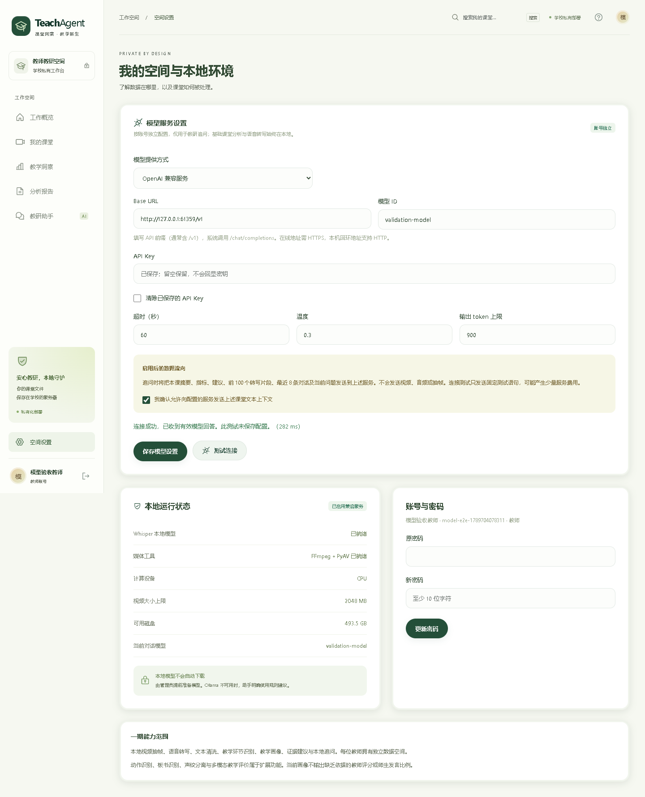

# TeachAgent 1.1.0 系统检验报告

检验日期：2026-09-18。范围：新增 OpenAI 兼容模型配置，以及视频、转写、分析、追问、教师与管理员功能、数据边界、WebUI 和静态演示的完整回归。

## 1. 结论与环境

本机回归通过：41 项后端测试、3 条浏览器完整流程、1 条 Pages 浏览器流程；本地版和 Pages 版均通过 TypeScript 检查与生产构建。真实本地 Whisper 完成禁网络转写。新在线模型功能已通过真实 HTTP 兼容协议模拟服务验证，尚未使用学校的真实供应商凭据验收。

环境为 Windows、Python 3.12、Node.js、Microsoft Edge、CPU int8 Whisper tiny。测试数据库、教师账号、模型凭据均为隔离测试数据；视频由本机中文语音合成生成。未使用真实课堂资料。CI 使用 Ubuntu、Python 3.12、Node.js 22、Chromium 与 FFmpeg，不下载 ASR 模型。

## 2. 功能检验矩阵

| 模块 | 已执行检查 | 结果 |
| --- | --- | --- |
| 教师认证 | 登录、会话、注销、密码更改撤销会话、登录频控、CSRF、Origin | 通过 |
| 数据隔离 | 教师间课堂、原文、报告、视频、帧、对话、删除和重试权限；教师拒绝管理员接口 | 通过 |
| 视频上传与播放 | 文件类型与大小限制、真实 MP4 上传、Range 206 片段回放、失败与删除清理 | 通过 |
| 抽帧与音轨 | 真实 FFmpeg 生成 2 秒视频、生成 JPG / WAV、无音轨明确失败、缺模型明确失败 | 通过；修复短片空抽帧 |
| 本地 ASR | 真实合成视频、磁盘模型、网络连接被禁止时完整处理、非空转写、报告下载 | 通过 |
| 队列状态 | 排队中禁止删除、报告、对话与账号备份，失败后重试重新入队 | 通过 |
| 文本蒸馏 | TXT / SRT / VTT 解析、清洗、环节与指标、未知说话人、优化建议证据 | 通过 |
| 报告导出 | Markdown / JSON / HTML、HTML 转义、浏览器真实下载 | 通过 |
| 本地追问 | 无服务时规则降级；显式规则模式零模型请求；Ollama 成功协议与回环地址限制 | 通过；Ollama 成功响应使用协议模拟 |
| 在线配置 | 默认本地、账号隔离、保存、刷新保留、草稿测试不保存、参数与同意校验 | 通过 |
| 在线凭据 | Fernet 加密落盘、接口不回显、留空保留、替换与清除、换地址不泄漏旧密钥、主密钥丢失拒绝使用 | 通过 |
| 兼容请求 | 实际 HTTP POST /v1/chat/completions、Bearer、模型参数、课堂上下文、连续对话历史与引擎来源 | 通过 |
| 在线故障 | 401 / 403 / 404 / 429 / 500 / 302、超时、空回答、错误脱敏、不写入成功对话 | 通过；超时通过异常注入覆盖 |
| 学校管理 | 创建教师账号、按账号 ZIP、备份不含凭据、审计记录 | 通过 |
| WebUI | 示例工作台、证据定位、导入、对话、保存反馈、错误反馈、手机导航、390×844 无横向溢出 | 通过 |
| Pages | /TeachAgent/ 子路径、直接演示、示例下载、模型设置预览、无密钥输入、保存/连接测试禁用 | 通过 |
| 网络边界 | Pages 不调用 /api/，示例无外部资源请求，ASR 阶段 Python socket.connect 封锁且零尝试 | 通过 |

## 3. 本轮修复

1. **短视频抽帧缺失**：常规每 30 秒采样可能对 2 秒短片输出零张 JPG。增加无采样结果时补抽首帧，并用真实视频验证。
2. **依赖审计**：初选加密库版本被当前漏洞库报告存在已知问题。固定升级到 cryptography 50.0.1；本机虚拟环境 pip 升级为 26.2.1，复测及审计通过。
3. **在线模式说明**：更新界面与文档的“全部不出校”旧描述，明确默认本地、在线追问可选、发送内容及错误行为。顶部标识改为“学校私有部署”，避免与在线追问矛盾。

测试脚本自身也经过修正：Windows TestClient 创建事件循环需要本机 socket pair，因此禁网只包围实际媒体与 ASR 处理阶段；模型保存成功断言限定在设置区域，避免与课堂保存 toast 冲突。以上均已重新运行通过。

## 4. 真实离线转写记录

最终回归的输入视频长 29.424989 秒；使用磁盘上的 faster-whisper-tiny，CPU / int8。本轮完整管线耗时约 2.12 秒，产出 1 张帧、7 个片段、82 个有效字符、1 处提问和 2 处互动邀请线索；网络连接尝试为 0。完成后通过真实 API 读取详情及下载 JSON 报告。

这是短合成音频的功能检验，不代表真实课堂识别准确率、长课速度或部署性能承诺。tiny 模型存在中文识别错误，也不提供声纹或教师/学生自动身份识别。正式使用应以学校实际录音和选定模型验收。

## 5. 构建、质量与依赖

| 检查 | 结果 |
| --- | --- |
| pytest | 41 passed；2 条第三方 TestClient 弃用提示 |
| Playwright 本地版 | 3 passed；示例、真实账号全流程、在线模型配置全流程 |
| Playwright Pages 版 | 1 passed；含模型配置预览与无 API 请求断言 |
| npm run build / build:pages | 通过 |
| Prettier format:check | 通过 |
| Ruff format / check --select F | 通过 |
| pip check | 无依赖冲突 |
| pip-audit | 当前环境未发现已知漏洞 |
| npm audit（官方 registry） | 0 项已知漏洞 |

npm 镜像源不提供审计接口，本次改用官方 registry 完成审计。漏洞审计只反映检验当日数据库结果，不能替代完整安全评估。

## 6. 未验证条件

- **真实在线供应商**：未获得真实模型 API Key；兼容服务验证使用本机 HTTP 测试服务，不宣称完成 OpenAI 或其他供应商真实推理。填写实际配置后点击“测试连接”完成现场验证。仅支持非流式 Chat Completions 文本协议，不支持 Responses API 或服务特有推理参数。
- **真实 Ollama 推理**：成功协议由本机模拟服务覆盖，真实界面验证含规则降级；未安装实际 Ollama 模型进行效果评测。
- **Docker**：本机 Docker 引擎未运行，无法完成容器构建与启动验证；原生服务已验证。
- **现场负载与运维**：未测试 GPU、长课并发压力、真实教室噪声、学校 HTTPS 证书、整机灾备恢复与硬盘故障。账号 ZIP 功能验证不等于完成整机恢复演练。
- **CI ASR**：CI 不下载模型，真实模型用例在缺少本地模型与合成视频时明确跳过；本机该项实际执行通过。CI 安装 FFmpeg 执行短视频测试。

## 7. 复现与发布

```bash
python -m pip install -r requirements-dev.txt
python -m pytest -q
python -m pip check
cd frontend
npm ci
npm run build
npm run build:pages
npm run format:check
npm run test:e2e
npm run test:pages
```

真实账号浏览器流程需要已启动的隔离测试后端，以及 TEACHAGENT_TEST_URL、TEACHAGENT_E2E_USERNAME、TEACHAGENT_E2E_PASSWORD。默认浏览器为 Edge；CI 设置 PLAYWRIGHT_CHANNEL=chromium。在线协议服务由测试临时启动并结束，不需要真实供应商凭据。

真实 ASR 用例需要提前准备 `ASR_MODEL_PATH` 和本机合成 `.data/smoke-video.mp4`；缺失时明确跳过，不会下载模型。报告的本机 41 项通过不包含跳过。

发布流程：推送 main → 后端与本地浏览器测试 → Pages 构建与静态浏览器测试 → GitHub Pages 部署。发布结果可在 [Actions](https://github.com/mm477706421/TeachAgent/actions) 核查。部署后可设置 TEACHAGENT_PAGES_URL 为 [公开演示地址](https://mm477706421.github.io/TeachAgent/) 再运行 test:pages。

新设置入口截图：


