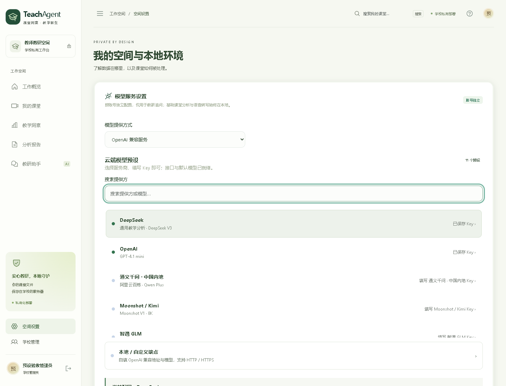

# 1.2.0 模型预设、管理员权限与 Word 验收

日期：2026-09-23。基线：792a758。

## 交付行为

- 云端配置提供 11 个服务商项目，可搜索、选中、查看 Key 保存状态。服务地址与模型由预设自动填入；用户填写 Key、确认文本发送范围后测试并保存。
- 每个账号独立保存各服务商的加密 Key。草稿切换不改变生效模型、不携带未保存的 Key；自定义 HTTP / HTTPS 配置保留。
- 现有 `admin` 管理员账号直接识别为超级管理员，无需更换密码或重建账户。只有超级管理员能创建管理员；普通管理员可以创建教师，但不能导出其他管理员的数据。
- 课堂主下载按钮改为 Word。默认报告 API 和显式 `format=docx` 返回真实 OOXML 文档，包含中文元信息、画像、指标表、环节时间分配、优化点、方法边界与完整转写。
- Pages 同样提供可打开的合成 Word 示例，不接收密钥或连接模型。



## 自动检查

基线 `python -m pytest -q`：56 passed。修改后：60 passed。

新增后端测试覆盖：Key-only 预设保存、后端地址绑定、多服务商密钥切换、加密落盘、不回显、按账号隔离、单项目清除、未知预设及未同意发送的拒绝；超级管理员识别、重复初始化、管理员创建和备份边界；真实 Word MIME / 文件包 / 中文正文 / 全部片段 / 账号隔离；Pages Word 与合成课堂内容一致。

本地版 Playwright：17 passed，覆盖真实管理员创建、普通管理员入口、预设搜索及保存、跨服务商 Key 留存、刷新、390px 布局、Word 下载字节、既有视频入口/文本导入/流式对话/停止/重试/报告/移动导航。

Pages Playwright：10 passed，覆盖仓库子路径下载、无后端请求、模拟流式对话以及 320–1920px 响应式布局。

Word 示例经 Microsoft Word 打开并渲染为 4 页，逐页检查文字、表格、页眉页脚和分页。基本 Python 静态错误检查与前端 Prettier 检查通过。系统级 Ruff 扩展规则包含原有未修复的风格告警，未将其声称为全量通过。

## 验证边界

供应商协议由本机兼容 HTTP 流服务及请求构造断言验证；没有使用用户真实供应商 Key 发起付费推理。默认模型可用性、额度与区域权限以供应商实际账户为准，可通过“测试连接”验证或切换自定义模型。既有课堂数据不作为测试样本外发。

## 部署与回滚

部署采用新版本目录、原子切换 `current`、现有服务器 Python 环境和既有 ASR 模型。切换前检查活动任务并备份 SQLite；保存原版本与数据，不重置账号。新增数据库表为增量创建。

`deploy/verify_upgrade.py` 对独立合成数据库分别检查基线、候选版本和回滚后的默认报告格式、超级管理员标识、预设接口及原课堂留存。`deploy/rollback.sh` 在副本上验证；正式回滚时使用：

```bash
sudo /opt/teachagent/current/deploy/rollback.sh /opt/teachagent/releases/OLD_REVISION
```

回滚仅移除旧客户端不认识的生效设置 `preset_id` 字段，保留端点、密钥、账号、课堂和新增配置表。回滚脚本不会替换或删除课堂数据库。部署后的运行版本与健康状态另由服务器现场检查确认。
